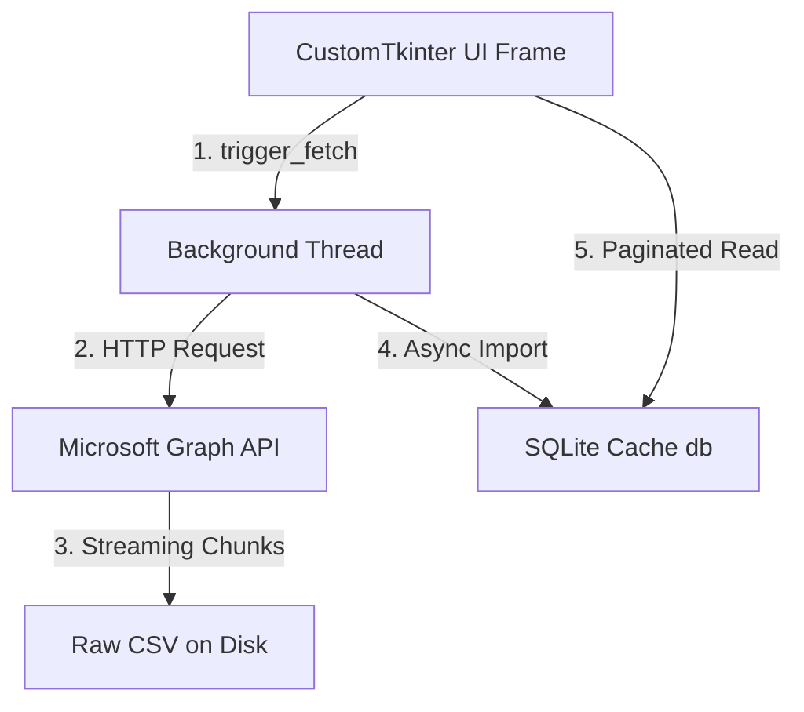

# M365 Telemetry Module Design & Scaling Guide

This document defines the architectural patterns, coding standards, and design principles for implementing new sections or sub-sections in the **Deal Assistant** application. Follow these guidelines to ensure consistency, safety, and scalability when handling 100K+ user tenant sizes.

---

## 1. Architectural Strategy

Every telemetry module must follow a decoupled **Model-View-Controller (MVC)**-style division:
1. **Core Service (Backend)**: Located in `core/graph/` (or `core/powershell/`). Independent of GUI components. Interacts with the API, returns raw objects, or writes raw CSV files.
2. **Database Cache (SQLite)**: Located in `core/graph/db.py`. Stores raw CSV outputs into a local SQLite cache. Used for fast paginated queries on the UI thread.
3. **UI Component (Frontend)**: Located in `telemetry/`. Builds CustomTkinter layouts, triggers the backend pipeline in a background thread, and queries the local SQLite cache to render paginated data.



---

## 2. Backend Service Guidelines

1. **Decouple API Logic**: Always put API request and data-wrangling code in `core/graph/` or `core/powershell/`. Do not import `customtkinter` or layout modules here.
2. **Streaming Chunk Downloads**: For large CSV reports, stream the download using chunk sizes of `8192` bytes to prevent high memory consumption:
   ```python
   with requests.get(download_url, stream=True) as response:
       response.raise_for_status()
       with open(output_path, "wb") as f:
           for chunk in response.iter_content(chunk_size=8192):
               if chunk: f.write(chunk)
   ```
3. **EXO V3 PowerShell Cmdlets**: If writing PowerShell scripts for Exchange Online, always use REST-based **V3 cmdlets** (`Get-EXOMailbox` / `Get-EXOMailboxStatistics`) rather than legacy cmdlets. Specify only the minimum required properties to prevent WinRM throttling:
   ```powershell
   Get-EXOMailbox -ResultSize Unlimited -PropertySets Minimum -Properties RecipientTypeDetails
   ```

---

## 3. Database Caching & File Storage Guidelines

1. **Raw CSV Preservation**: All sections must save raw CSV telemetry data to the designated reports folder. Raw compliance files must follow the path template:
   `telemetry/reports/{tenant_id}_{client_id}/{report_name}.csv`
2. **Temporary File Handling**: Write downloads to a `.tmp` file (e.g. `report_name.csv.tmp`) first, and swap it with the production CSV only upon successful completion. Ensure temporary files are deleted in a `finally` block if the execution fails or is cancelled.
3. **Bulk SQLite Imports**: Use `aiosqlite` inside a single transaction to drop and recreate the table, then batch-insert data using `executemany` (e.g., in chunks of 5,000):
   ```python
   from core.graph.db import import_csv_to_sqlite
   
   # Run asynchronously inside a background worker
   asyncio.run(import_csv_to_sqlite(csv_path, db_path, "table_name"))
   ```
4. **SQLite Column Escaping**: Column headers dynamically parsed from Microsoft Graph may contain reserved SQL keywords (e.g. `Default`, `Group`, `Order`).
   - **Rule**: Always wrap column names in square brackets `[column_name]` in SQL query builders to prevent syntax errors:
     ```python
     cols_def = ", ".join(f"[{h}] TEXT" for h in sanitized_headers)
     await db.execute(f"CREATE TABLE {table_name} ({cols_def})")
     ```
5. **Header Key Matching**: When reading database query results, ensure column name strings are sanitized exactly matching the DB schema (e.g., spaces replaced by underscores, case preserved):
   ```python
   # Correct Sanitized Key (Original Header: "SKU Part Number")
   sku_name = row["SKU_Part_Number"]
   
   # Incorrect Key (will raise KeyError or return None)
   sku_name = row["sku_part_number"] 
   ```

---

## 4. Error Handling, Logging, and Retry Policy

1. **Graceful Separation of Warnings and Exceptions**:
   - **Log Files**: Always log the detailed raw traceback (`exc_info=True`) to log files (e.g. `telemetry_log.txt` via `logger.error()`) for system audits and developers.
   - **UI Views**: Catch exceptions gracefully and show user-friendly instructions. Avoid displaying raw tracebacks on the UI frame. For example, if a `403 Forbidden` error is returned, tell the user:
     `"Directory read permission required. Please grant 'Directory.Read.All' to your App Registration in Microsoft Entra ID."`
2. **Individual Tab Retryability**:
   - Every telemetry frame/sub-frame must remain individually reloadable. Provide a `↻ Reload` / `Try Again` button on every section.
   - Clicking reload must reset the local states, clear the grid, and spawn a fresh thread to fetch data from Graph.
3. **Configurable Retries & Backoff**:
   - Expose retry counts and backoff delays in the central dashboard configuration.
   - Pass these settings to all Graph Clients to automatically handle intermittent connection drops and HTTP 429 rate limit exceptions:
     ```python
     client = GraphClient(
         tenant_id=tenant,
         client_ids=client_id,
         client_secrets=client_secret,
         retries=retries_val,
         backoff=backoff_val
     )
     ```

---

## 5. UI Thread-Safety & Layout Guidelines

1. **Never Block the Main Thread**: Never make API requests, run shell scripts, or parse entire files directly inside UI button commands or layout initializers.
2. **Use Background Workers & Semaphores**: Spawn fetches in a background `threading.Thread`. If a semaphore is provided, acquire and release it to keep concurrently running queries limited (e.g., max 3 active queries globally):
   ```python
   threading.Thread(target=self._execute_worker, args=(tenant, client_id), daemon=True).start()
   ```
3. **Request IDs and Stale Threads**: Users can toggle dashboard components or re-submit fetches. To prevent stale thread callbacks from corrupting UI state, track thread requests with `current_request_id`:
   ```python
   # Inside worker thread execution
   if self.is_cancelled or request_id != self.current_request_id:
       return
   ```
4. **Paginated Data Retrieval**: Do not read full SQLite tables or CSVs in memory. Instead, retrieve data using SQL pagination (LIMIT and OFFSET):
   ```sql
   SELECT * FROM table_name WHERE [column] != '' LIMIT ? OFFSET ?
   ```
5. **Layout & Color Consistency**:
   - Match colors using predefined tokens in `telemetry/styles.py` (`COLOR_PRIMARY`, `COLOR_SURFACE`, `COLOR_OUTLINE_LIGHT`, etc.). Do not define ad-hoc hex values in frames.
   - Every telemetry panel must display floating execution timers (`⏱ 4.25s`) on the top-right upon successful completion.

---

## 6. Standard Component Template

### Backend Pipeline Component (`core/graph/telemetry_feature.py`)
```python
import logging
from core.graph.client import GraphClient

logger = logging.getLogger(__name__)

class FeatureService:
    def __init__(self, client: GraphClient) -> None:
        self.client = client

    def get_feature_data(self) -> dict:
        token_slot = self.client.get_active_token()
        session = self.client.get_session()
        headers = {"Authorization": f"Bearer {token_slot['token']}"}
        
        try:
            url = "https://graph.microsoft.com/v1.0/reports/myTelemetryEndpoint"
            resp = session.get(url, headers=headers)
            resp.raise_for_status()
            return resp.json()
        finally:
            self.client.release_token(token_slot)
```

### UI Frame Component (`telemetry/telemetry_feature.py`)
```python
import os
import csv
import logging
import threading
import sqlite3
import asyncio
import customtkinter as ctk
from core.graph.client import GraphClient
from core.graph.db import import_csv_to_sqlite
from telemetry.styles import *

logger = logging.getLogger("M365TelemetryAsyncLogger.FeatureUI")

class FeatureTelemetryFrame(ctk.CTkFrame):
    def __init__(self, master, log_callback, credentials_callback, status_change_callback, semaphore=None, **kwargs):
        super().__init__(master, fg_color="transparent", **kwargs)
        self.log_msg = log_callback
        self.get_credentials = credentials_callback
        self.on_status_change = status_change_callback
        self.semaphore = semaphore
        
        self.status = None
        self.is_cancelled = False
        self.current_request_id = 0
        self.current_page = 0
        self.ITEMS_PER_PAGE = 10
        self.csv_path = None
        
        self.build_ui()

    def build_ui(self):
        # Build CTk Labels, Grids, and Page controls here...
        pass

    def trigger_fetch(self, tenant, client_id, client_secret):
        self.status = "loading"
        self.is_cancelled = False
        self.current_page = 0
        
        script_dir = os.path.dirname(os.path.abspath(__file__)) if '__file__' in globals() else os.getcwd()
        reports_dir = os.path.join(script_dir, "reports", f"{tenant}_{client_id}")
        self.csv_path = os.path.join(reports_dir, "feature_telemetry.csv")
        
        self._set_state_loading("Scanning feature details...")
        self.on_status_change()
        
        threading.Thread(
            target=self._execute_worker, 
            args=(tenant, client_id, client_secret, self.current_request_id), 
            daemon=True
        ).start()

    def _execute_worker(self, tenant, client_id, client_secret, request_id):
        if self.semaphore: self.semaphore.acquire()
        temp_csv_path = self.csv_path + ".tmp"
        try:
            if self.is_cancelled or request_id != self.current_request_id: return

            # 1. Fetch from Microsoft Graph
            client = GraphClient(tenant_id=tenant, client_ids=client_id, client_secrets=client_secret)
            client.authenticate(required_scopes=["Directory.Read.All"])
            # (Execute your pipeline/service calls...)
            
            # 2. Write CSV to Disk (Compliance audit layer)
            # 3. Import to SQLite Cache (Fast UI query layer)
            db_path = os.path.join(os.path.dirname(self.csv_path), "telemetry_cache.db")
            asyncio.run(import_csv_to_sqlite(self.csv_path, db_path, "feature_table"))
            
            if self.is_cancelled or request_id != self.current_request_id: return
            self.status = "success"
            self.after(0, self._render_success, request_id)
        except Exception as e:
            logger.error(f"Error fetching feature telemetry: {e}", exc_info=True)
            self.status = "error"
            self.after(0, self._render_error, str(e), request_id)
        finally:
            if os.path.exists(temp_csv_path):
                try: os.remove(temp_csv_path)
                except Exception: pass
            if self.semaphore: self.semaphore.release()
            self.after(0, self.on_status_change)

    def _load_page_from_sqlite(self, page):
        if not self.csv_path or not os.path.exists(self.csv_path): return [], 0
        db_path = os.path.join(os.path.dirname(self.csv_path), "telemetry_cache.db")
        if not os.path.exists(db_path): return [], 0

        conn = sqlite3.connect(db_path)
        try:
            conn.row_factory = sqlite3.Row
            cursor = conn.cursor()
            
            # Retrieve counts
            cursor.execute("SELECT COUNT(*) FROM feature_table WHERE [Feature_ID] IS NOT NULL AND [Feature_ID] != ''")
            row = cursor.fetchone()
            total_count = row[0] if row else 0

            # Retrieve page
            offset = page * self.ITEMS_PER_PAGE
            cursor.execute(
                "SELECT [Feature_ID], [Status] FROM feature_table WHERE [Feature_ID] IS NOT NULL AND [Feature_ID] != '' LIMIT ? OFFSET ?",
                (self.ITEMS_PER_PAGE, offset)
            )
            rows = cursor.fetchall()
            
            page_data = []
            for r in rows:
                page_data.append((r["Feature_ID"] or "", r["Status"] or ""))
            return page_data, total_count
        except Exception as e:
            logger.error(f"Error reading SQLite: {e}")
            return [], 0
        finally:
            conn.close()

    def _render_success(self, request_id):
        if self.is_cancelled or request_id != self.current_request_id: return
        self._update_grid()
        
    def _render_error(self, err, request_id):
        if self.is_cancelled or request_id != self.current_request_id: return
        # Display error state in UI...
        pass
        
    def _update_grid(self):
        page_data, total_count = self._load_page_from_sqlite(self.current_page)
        # Populate CustomTkinter cells and draw page labels/buttons...
        pass
```
